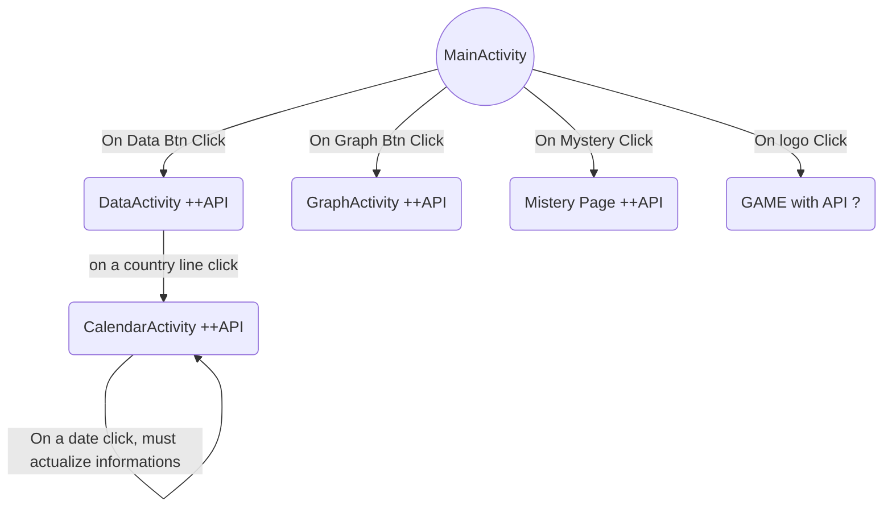

```
 ________  ________  ___      ___ ___  ________  ________  _________  ________
|\   ____\|\   __  \|\  \    /  /|\  \|\   ___ \|\   __  \|\___   ___\\   __  \
\ \  \___|\ \  \|\  \ \  \  /  / | \  \ \  \_|\ \ \  \|\  \|___ \  \_\ \  \|\  \
 \ \  \    \ \  \\\  \ \  \/  / / \ \  \ \  \ \\ \ \   __  \   \ \  \ \ \   __  \
  \ \  \____\ \  \\\  \ \    / /   \ \  \ \  \_\\ \ \  \ \  \   \ \  \ \ \  \ \  \
   \ \_______\ \_______\ \__/ /     \ \__\ \_______\ \__\ \__\   \ \__\ \ \__\ \__\
    \|_______|\|_______|\|__|/       \|__|\|_______|\|__|\|__|    \|__|  \|__|\|__|

```


[toc]

# Graph Descriptif du TODO




Ce graphe présente l'ensemble des activités et des Listeners à implémenter et indique les activités ayant besoin de la data base.


> <u>/!\</u> Toutes les strings des textview doivent être dans les *resources values*.


# TODO


## MAIN ACTIVITY

- [x] LAYOUT
- [x] On DataBtn Click Listener
- [x] On GraphBtn Click Listener
- [ ] On MisteryBtn Click Listener
- [ ] ***BONUS :*** on LogoBtn Listener


## DATA ACTIVITY

- [x] Layout
- [x] Recycler View Layout
- [x] Recycler View Optimization
- [x] On Click Listener for List Element (Country name sent to Calendar Activity)
- [x] RETROFIT INTERFACE AND DATACLASSES


## GRAPH ACTIVITY

- [x] Layout
- [x] Recycler View Layout
- [x] Recycler View Optimization
- [x] Listener for each element which actualize graph data
- [x] Graph which present data per day of in terms of : 
  - [x] Confirmed Btn
  - [x] DeathsBtn
  - [x] RecoveryBtn
- [x] RETROFIT INTERFACE AND DATACLASSES


## CALENDAR ACTIVITY

- [x] LAYOUT
- [x] Calendar View
- [ ] On Date Changed Listener
- [ ] RETROFIT INTERFACE AND DATACLASSES


## Mistery Activity

Ideas :

- Maybe pie graph and calendar gathered on the same activity
  - The graph shows confirmed cases, deaths and Recoveries in the same piegraph per day


## EASTEREGG ACTIVITY

- [ ] Layout
- [ ] GameAPI